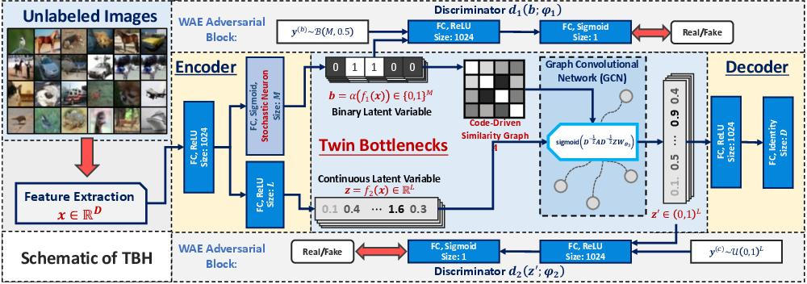

# Auto-Encoding Twin-Bottleneck Hashing

This is the main repository for our [**CVPR2020** work](#tbh):
* [\[CVPR20\] Auto-Encoding Twin-Bottleneck Hashing](https://arxiv.org/abs/2002.11930)

which is an unsupervised deep hashing work.

We as well provide the code of our supervised deep hashing work on **ICCV2019 Workshops** [here](#jmlh):
* [\[ICCVW19\] Embarrassingly Simple Binary Representation Learning](http://openaccess.thecvf.com/content_ICCVW_2019/html/CEFRL/Shen_Embarrassingly_Simple_Binary_Representation_Learning_ICCVW_2019_paper.html)

## Requirements
```angular2
python=3.6
tensorflow>=2.0 (tested with tf2.1)
scipy
sklearn
```
From this time on, I move to tensorflow2, though it is shitty and inhumane compared with tf1. \
**Note that this is a re-implemented repository of our original work. 
If you find any difficulty in reproducing the result, please refer to [the old, uncleaned and ugly version](https://github.com/ymcidence/GraphBinary).**

## Data
This work supports `tf.data.TFRecordDataset` as the data feed. 
I provide the following data as training examples:
* Cifar-10 ([Training](https://drive.google.com/open?id=1Ie0ucwA1r5tG9pETWbYaR50Y2Mz76h0A), [Test](https://drive.google.com/open?id=1GdHaetvz6cwo2UE7_epMFci62ViNiDjB))

If one needs to run experiments on other datasets, please refer to [`util/data/make_data.py`](./util/data/make_data.py) to build TFRecords.

Please organize the data folder as follows:
```angular2
data
  |-cifar10 (or other dataset names)
    |-train.tfrecords
    |-test.tfrecords
```

## <a name="tbh"></a> Train Auto-Encoding Twin-Bottleneck Hashing


Simply run
```angular2
python ./run_tbh.py
```
to train the model.

The resulting checkpoints will be placed in `./result/set_name/model/date_of_today` with tensorboard events in `./result/set_name/log/date_of_today`.

The mAP results shown on tensorboard are just for illustration (the actual score would be slightly higher than the ones on tensorboard), 
since I do not update all dataset codes upon testing. Please kindly evaluate the results by saving the proceeded codes after training.

## <a name="jmlh"></a> Train Embarrassingly Simple Binary Representation Learning
Simply run
```angular2
python ./run_jmlh.py
```
to train the model.

The resulting checkpoints will be placed in `./result/set_name_JMLH/model/date_of_today` with tensorboard events in `./result/set_name_JMLH/log/date_of_today`.

The mAP results shown on tensorboard are just for illustration (the actual score would be slightly higher than the ones on tensorboard), 
since I do not update all dataset codes upon testing. Please kindly evaluate the results by saving the proceeded codes after training.
